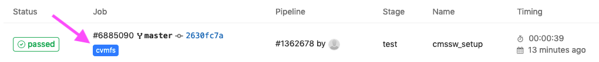

Before getting into details, a few links to useful documentation on GitLab
CI/CD and also CERN-specific information:

- [GitLab CI/CD documentation][gitlab-ci]
- [CERN Knowledge Base Articles for the Git Service][snow-git]

These pages serve as a good entrypoint in case of problems and questions.

> ## Create a new GitLab project to follow along
> Please [create a new GitLab project][gitlab-newproject] now to follow along.
> To do so, select "Create blank project" and provide a project name.
> You can for instance call it `awesome-gitlab-cms`. 
> You need to specify the project visibility level. Private, the default, is fine for this tutorial.
> In the following, we will assume that all your work is in a directory called `awesome-workshop` in your
> home directory and we will now clone the newly created project in a local repository therein:
> `~/awesome-workshop/awesome-gitlab-cms`
{: .callout}

The commands would look like this (replace `${USER}` by your CERN
username in case it isn't the same as on your laptop):

~~~
mkdir -p ~/awesome-workshop
cd awesome-workshop
git clone ssh://git@gitlab.cern.ch:7999/${USER}/awesome-gitlab-cms.git
cd awesome-gitlab-cms
~~~
{: .language-bash}

## Choosing the correct GitLab runner

We are now going to setup a GitLab CI. For that, we need to create a `.gitlab-ci.yml` file.
Standard [GitLab CI runners at CERN](https://gitlab.docs.cern.ch/docs/Build%20your%20application/CI-CD/Runners/)
do not mount CVMFS, which is required in many cases, for example for setting up CMSSW, to create a grid proxy, or to access LCG software stacks in `/cvmfs/sft.cern.ch/`.
In order to get a runner that mounts CVMFS, you need
to add a `tag` to your `gitlab-ci.yml` file:

~~~
tags:
  - cvmfs
~~~
{: .language-yaml}

A minimal `.gitlab-ci.yml` file to get a runner with CVMFS looks like the following:

~~~
cmssw_setup:
  tags:
    - cvmfs
  script:
    - ls /cvmfs/cms.cern.ch/
~~~
{: .language-yaml}

The `cmssw_setup` line defines the name of the job, and all the job does is
list `/cvmfs/cms.cern.ch/`, which would fail if CVMFS isn't mounted. 

To trigger the pipeline we need to commit the file and push it to GitLab:

~~~
git add .gitlab-ci.yml
git commit -m "added a CI"
git push
~~~
{: .language-bash}

If you now navigate the GitLab UI with your browser you will see the CI running and eventually finishing.
You can check the output, and also the `cvmfs` label:

In the following you'll will learn how to setup a GitLab CI job that runs CMSSW.

This should be regarded as an example for any CI job requiring access to CVMFS and accessing CMS-restricted files.

## Setting up CMSSW

> ## CMS-specific setup
> Since the default user in the runner is not your username and the container doesn't
> know anything about you in the first place, it doesn't have any
> CMS-related environment as people registered as CMS members (via the _zh_
> group on LXPLUS). This means that everything needs to be set up manually.
{: .callout}

To set up a CMSSW release (for example `CMSSW_10_6_30`), you would usually
run the following commands on LXPLUS:

~~~
cmssw-el7
source /cvmfs/cms.cern.ch/cmsset_default.sh
cmsrel CMSSW_10_6_30
cd CMSSW_10_6_30/src
cmsenv
~~~
{: .language-bash}

The first command is needed because CMSSW_10_6_30 is pretty old (we chose an old one on purpose!) and it does not have any build for the recent alma9 LXPLUS. 
So we need to start a CentOS7 container first, which we do with the `cmssw-el7` command, as described in the [CMS singularity guide](https://cms-sw.github.io/singularity.html).

Depending on the software version chosen, the third command may print out a warning such as

~~~
WARNING: Developer's area is created for non-production architecture slc7_amd64_gcc820. Production architecture for this release is slc7_amd64_gcc700.
~~~
{: .output}

which can be ignored in this case (or could be removed by first executing
`export SCRAM_ARCH=slc7_amd64_gcc700`).

The command `source /cvmfs/cms.cern.ch/cmsset_default.sh` sets several
environment variables, in particular adding `/cvmfs/cms.cern.ch/common` to
the `${PATH}`. You can check this by running `echo ${PATH}`. Another effect
of this command is that a few helper functions are defined, such as `cmsrel` and `cmsenv`.

> ## Exercise: Determining CMSSW-related aliases
> What are the actual commands behind `cmsenv` and `cmsrel`?
{: .challenge}

> ## Solution: Determining CMSSW-related aliases
> The most important aliases are in the table below:
>
> |-------------+---------------------------------|
> | Alias       | Command                         |
> |-------------+---------------------------------|
> | `cmsenv`    | ``eval `scramv1 runtime -sh` `` |
> | `cmsrel`    | `scramv1 project CMSSW`         |
> |-------------+---------------------------------|
>
> The meaning of `eval`: The args are read and concatenated together into a
> single command. This command is then read and executed by the shell, and
> its exit status is returned as the value of `eval`. If there are no args,
> or only null arguments, `eval` returns 0.
>
{: .solution}

A common pitfall when setting up CMSSW in GitLab is that the execution
fails because the setup script doesn't follow best practices for shell
scripts such as returning non-zero return values even if the setup is OK or
using unset variables. Even if the script exits without visible error message,
there could be something wrong. It is therefore often a good idea to
circumvent issues like that by disabling strict checks (issuing `set +u`) before running the
setup command and enabling these checks afterwards again (issuing `set -u`).

> ## Exercise: Set up CMSSW in GitLab
> Knowing all this, can you write the `.gitlab-ci.yml` file to set up CMSSW in GitLab starting from the fragment above and check if this is all working by executing `cmsRun --help` at the end?
{: .challenge}

> ## Solution: Set up CMSSW in GitLab
> Here is a possible solution:
>
> ~~~
> cmssw_setup:
>   image: registry.cern.ch/docker.io/cmssw/el7:x86_64
>   tags:
>     - cvmfs
>   variables:
>     # This is also set on LXPLUS
>     CMS_PATH: /cvmfs/cms.cern.ch
>   script:
>     - set +u && source ${CMS_PATH}/cmsset_default.sh; set -u
>     - export  SCRAM_ARCH=slc7_amd64_gcc700
>     - cmsrel CMSSW_10_6_30
>     - cd CMSSW_10_6_30/src
>     - cmsenv
>     - cmsRun --help
> ~~~
> {: .language-yaml}
>
> The `image` directive tells the gitlab runner that it should run in a CentOS7 container, just like you would manually do on LXPLUS issuing `cmssw-el7`.
> The `set +u` command turns off errors for referencing unset variables. It isn't really needed here, since `-u` (i.e. not allowing to use unset variables) isn't set by default, but the script would fail if one used `set -u` somewhere else, so it's safer to catch this here.
{: .solution}

The reason why in the example above the variable `${CMS_PATH}` is used and not simply
`/cvmfs/cms.cern.ch` directly is just to mimic the default environment you would get on
LXPLUS. You can check if this is the case for you as well by running `env | grep CMS_PATH`
after logging on to LXPLUS.

You can see some examples in the [payload GitLab repository][payload-gitlab-cms] for this lesson.


